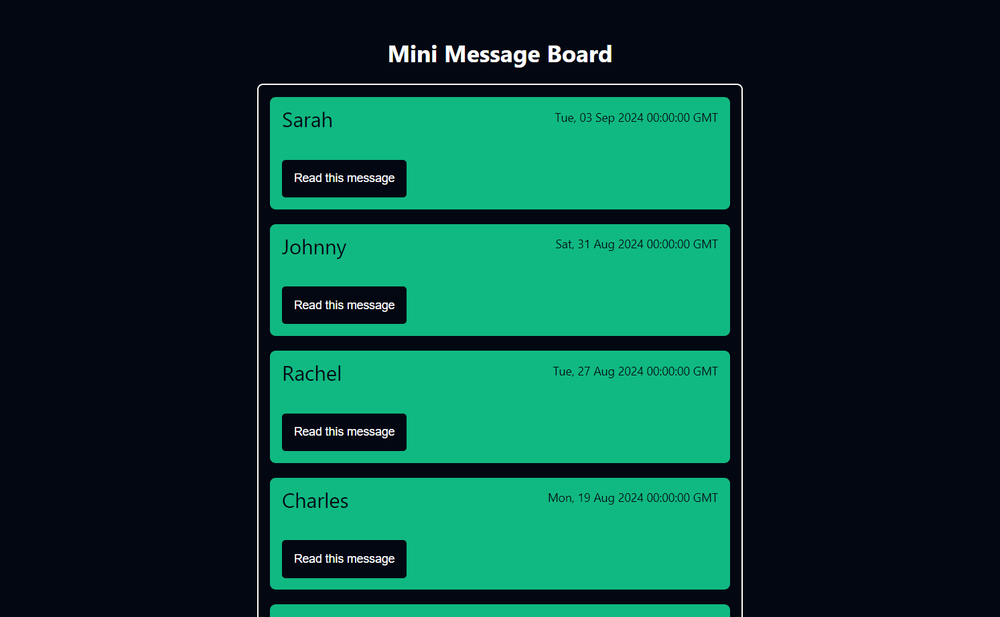

# Mini Message Board

This is a simple message board application where users can view, add, and display individual messages. The application features a dynamic interface that allows for easy navigation and interaction with posted messages.

  

## Technologies Used

- Node.js
- Express.js
- EJS (Embedded JavaScript)
- HTML
- CSS

## Features

- **View Messages**: Browse through all posted messages on the homepage.
- **Add New Message**: Post a new message by filling out a simple form.
- **View Message Details**: Access individual messages by their unique ID.
- **Responsive Design**: Enjoy a consistent experience across different devices.

## How to Use

1. On the homepage, view all the messages posted by users.
2. To add a new message, click the "New Message" button and fill out the form.
3. Click on any message to view its details on a dedicated page.

